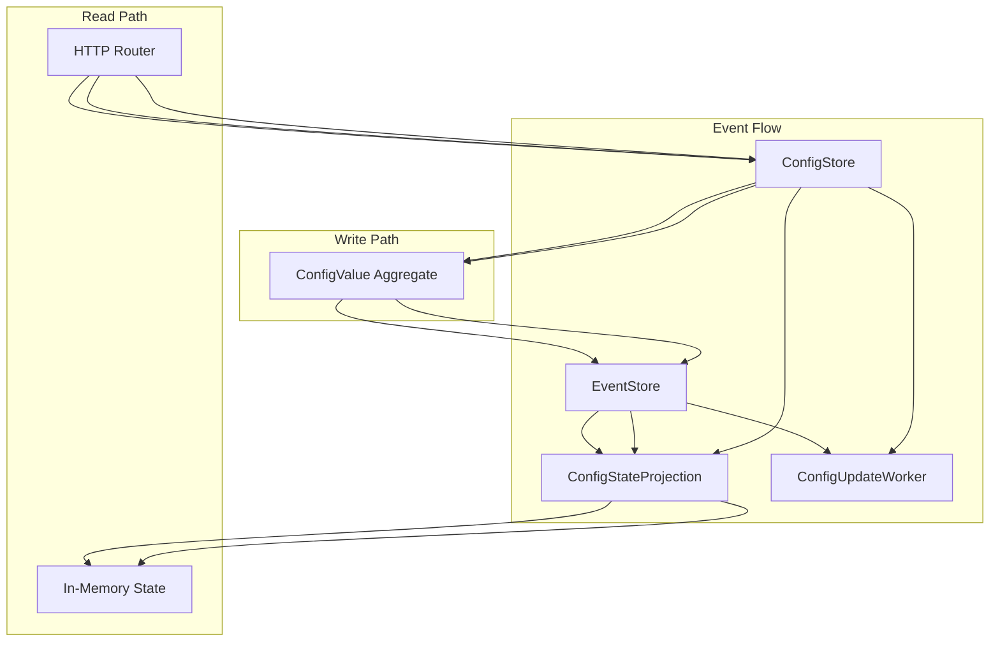

# Config API Operational Runbook

## Overview

This document provides operational guidance for the Config API system, including troubleshooting steps, monitoring recommendations, and recovery procedures after the comprehensive bug fixes implemented to resolve persisted value reading issues.

## System Architecture



## Recent Bug Fixes

### Primary Issue Resolved
- **Event Replay Implementation**: ConfigStateProjection now properly rebuilds state from existing events on startup
- **Enhanced Logging**: Comprehensive logging added throughout the system for better debugging
- **Error Handling**: Robust error handling and recovery mechanisms implemented
- **Event Subscription**: Improved event subscription with automatic reconnection

### Files Modified
- `lib/config_api/projections/config_state_projection.ex` - Event replay and subscription improvements
- `lib/config_api_web/router.ex` - Request/response logging
- `lib/config_api/config_update_worker.ex` - Enhanced message handling and statistics
- `lib/config_api/ConfigStore.ex` - Better error handling and logging

## Monitoring and Observability

### Key Log Messages to Monitor

#### Successful Operations
```
[info] PUT /config/my_config - Setting value: "my_value"
[info] PUT /config/my_config - Successfully stored value: "my_value"
[info] Config updated at 2024-01-01T10:00:00Z: name=my_config, old_value=nil, new_value=my_value [msg #1]
```

#### System Startup
```
[info] ConfigStateProjection starting...
[info] Rebuilding ConfigStateProjection state from existing events...
[info] Found 5 events to replay
[info] State rebuild complete: 3 configurations restored
[info] ConfigStateProjection subscribed to EventStore events
[info] ConfigUpdateWorker starting...
[info] ConfigUpdateWorker registered as :config_update_worker and ready to receive messages
```

#### Warning Signs
```
[warning] Starting with empty state due to event read failure
[warning] Starting without event subscription - real-time updates disabled
[error] Failed to subscribe to EventStore: connection_refused
[error] PUT /config/my_config - Failed to store value: internal_error
```

### Health Check Endpoints

#### ConfigUpdateWorker Statistics
```elixir
ConfigApi.ConfigUpdateWorker.get_stats()
# Returns: %{message_count: 42, uptime_seconds: 3600, started_at: ~U[2024-01-01 10:00:00Z]}
```

#### Projection State
```elixir
ConfigApi.Projections.ConfigStateProjection.get_state()
# Returns current projection state with all configurations
```

## Troubleshooting Guide

### Issue: Persisted Values Not Found After Restart

**Symptoms:**
- GET requests return 404 for previously stored configurations
- Log shows "Starting with empty state"

**Root Cause:**
- Event replay failure during projection startup

**Resolution:**
1. Check EventStore connectivity:
   ```bash
   # Check database connection
   docker-compose logs postgres
   ```

2. Restart the projection with logging:
   ```elixir
   # In IEx console
   GenServer.stop(ConfigApi.Projections.ConfigStateProjection, :normal)
   {:ok, _} = ConfigApi.Projections.ConfigStateProjection.start_link([])
   ```

3. Verify event replay logs:
   ```
   [info] Rebuilding ConfigStateProjection state from existing events...
   [info] Found X events to replay
   [info] State rebuild complete: X configurations restored
   ```

### Issue: Config Update Logs Missing

**Symptoms:**
- PUT requests succeed but no "Config updated" logs appear
- ConfigUpdateWorker message count not increasing

**Root Cause:**
- ConfigUpdateWorker not receiving messages or not started

**Resolution:**
1. Check worker status:
   ```elixir
   Process.whereis(:config_update_worker)
   ConfigApi.ConfigUpdateWorker.get_stats()
   ```

2. Restart worker if needed:
   ```elixir
   GenServer.stop(:config_update_worker, :normal)
   {:ok, _} = ConfigApi.ConfigUpdateWorker.start_link([])
   ```

3. Test message delivery:
   ```elixir
   ConfigApi.ConfigUpdateWorker.notify_config_update("test", "old", "new")
   ```

### Issue: EventStore Subscription Failure

**Symptoms:**
- Log shows "Failed to subscribe to EventStore"
- Real-time updates not working

**Root Cause:**
- EventStore connection issues or subscription limits

**Resolution:**
1. Check EventStore status:
   ```bash
   docker-compose ps eventstore
   ```

2. Verify database connectivity:
   ```bash
   docker-compose exec postgres psql -U postgres -d config_api_eventstore -c "\dt"
   ```

3. Force reconnection:
   ```elixir
   # Send reconnection message
   send(ConfigApi.Projections.ConfigStateProjection, {:subscription_error, :test_reconnect})
   ```

### Issue: High Memory Usage

**Symptoms:**
- Application memory usage growing over time
- System becoming unresponsive

**Root Cause:**
- Large number of events in projection state
- Memory leak in event processing

**Resolution:**
1. Check projection state size:
   ```elixir
   state = ConfigApi.Projections.ConfigStateProjection.get_state()
   map_size(state.configs)
   ```

2. Monitor event processing:
   ```bash
   grep "Found.*events to replay" /path/to/logs
   ```

3. Consider event stream snapshots if event count is very high

## Recovery Procedures

### Complete System Recovery

1. **Stop Application:**
   ```bash
   docker-compose down
   ```

2. **Check Database Integrity:**
   ```bash
   docker-compose up postgres
   docker-compose exec postgres psql -U postgres -d config_api_eventstore -c "SELECT COUNT(*) FROM events;"
   ```

3. **Start Application:**
   ```bash
   docker-compose up -d
   ```

4. **Verify Startup:**
   ```bash
   docker-compose logs config_api | grep "ConfigStateProjection started"
   docker-compose logs config_api | grep "ConfigUpdateWorker registered"
   ```

5. **Test Functionality:**
   ```bash
   # Store a test configuration
   curl -X PUT http://localhost:4000/config/test_recovery -d '{"value":"test_value"}' -H "Content-Type: application/json"
   
   # Retrieve the configuration
   curl http://localhost:4000/config/test_recovery
   ```

### Data Recovery from EventStore

If projection state is corrupted but EventStore is intact:

1. **Reset Projection:**
   ```elixir
   # Stop projection
   GenServer.stop(ConfigApi.Projections.ConfigStateProjection, :normal)
   
   # Start fresh (will rebuild from events)
   {:ok, _} = ConfigApi.Projections.ConfigStateProjection.start_link([])
   ```

2. **Verify Recovery:**
   ```elixir
   # Check all configurations are restored
   configs = ConfigApi.ConfigStore.all()
   IO.inspect(configs, label: "Recovered Configurations")
   ```

## Performance Tuning

### Event Replay Optimization

For systems with many events:

1. **Monitor Replay Time:**
   - Check logs for replay duration
   - Events should process at >1000/second

2. **Database Optimization:**
   - Ensure proper indexing on EventStore tables
   - Consider connection pooling

3. **Memory Management:**
   - Monitor projection state size
   - Consider periodic state snapshots

### Logging Configuration

Adjust logging levels in production:

```elixir
# config/prod.exs
config :logger, level: :info

# For debugging, temporarily use:
config :logger, level: :debug
```

## Alerting Recommendations

### Critical Alerts
- EventStore connection failures
- Projection startup failures
- ConfigUpdateWorker crashes

### Warning Alerts
- Event replay taking >30 seconds
- High error rates on API endpoints
- Memory usage above 80%

### Monitoring Queries

```elixir
# Check system health
%{
  projection_configs: length(ConfigApi.ConfigStore.all()),
  worker_stats: ConfigApi.ConfigUpdateWorker.get_stats(),
  projection_state: ConfigApi.Projections.ConfigStateProjection.get_state()
}
```

## Testing Procedures

### End-to-End Health Check

Run the comprehensive test suite:

```bash
mix test test/config_api/integration_test.exs
```

### Manual Verification

1. **Store Configuration:**
   ```bash
   curl -X PUT http://localhost:4000/config/health_check -d '{"value":"healthy"}' -H "Content-Type: application/json"
   ```

2. **Retrieve Configuration:**
   ```bash
   curl http://localhost:4000/config/health_check
   ```

3. **Verify Logs:**
   ```bash
   docker-compose logs config_api | tail -20
   ```

4. **Check Worker Stats:**
   ```elixir
   ConfigApi.ConfigUpdateWorker.get_stats()
   ```

## Deployment Checklist

- [ ] Database migrations applied
- [ ] EventStore schema up to date
- [ ] Log levels configured appropriately
- [ ] Health checks passing
- [ ] Monitoring alerts configured
- [ ] Backup procedures in place
- [ ] Recovery procedures tested

## Contact Information

For escalation:
- **Development Team**: dev-team@company.com
- **DevOps**: devops@company.com
- **Emergency**: on-call-engineer@company.com

## Changelog

### 2024-01-01 - Major Bug Fix Release
- Fixed event replay in ConfigStateProjection
- Added comprehensive logging throughout system
- Enhanced error handling and recovery
- Implemented health monitoring
- Created comprehensive test suite