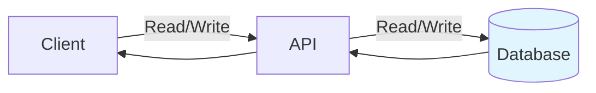
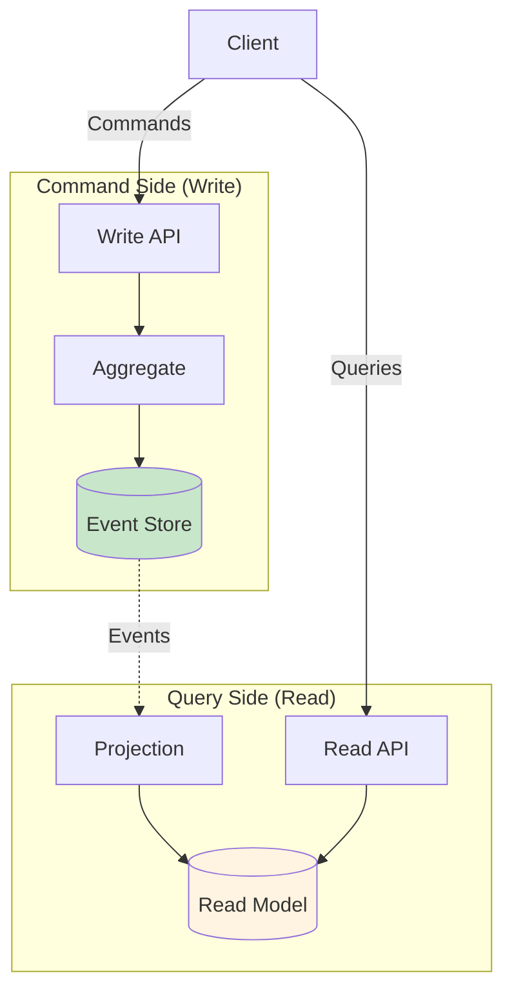
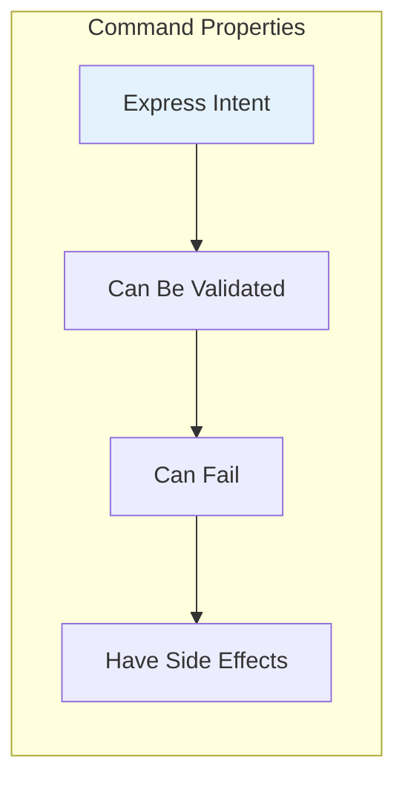
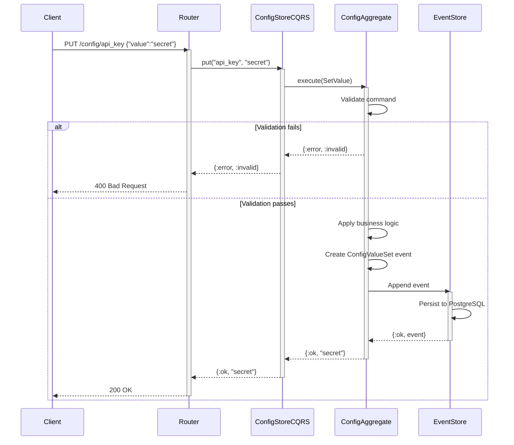
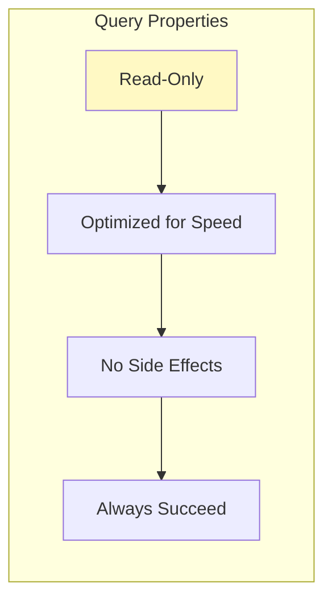
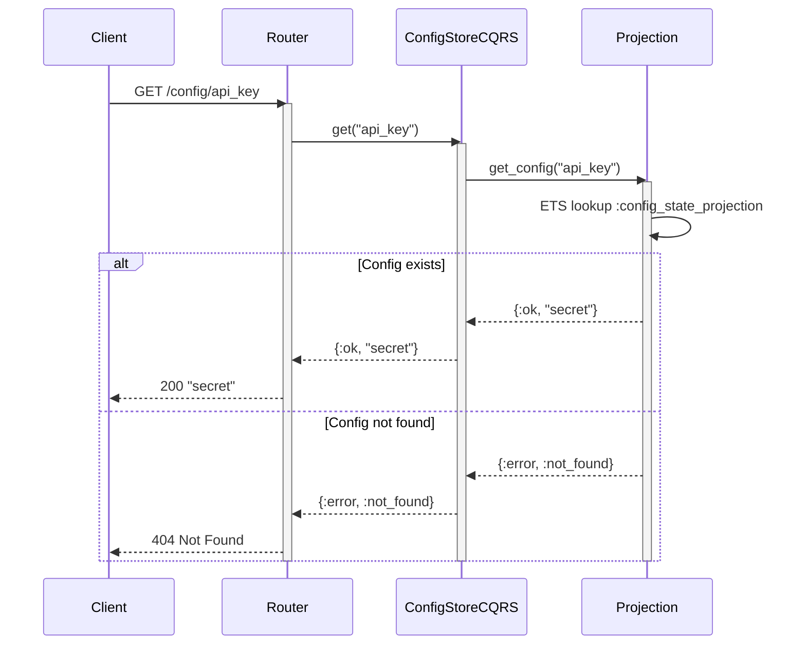
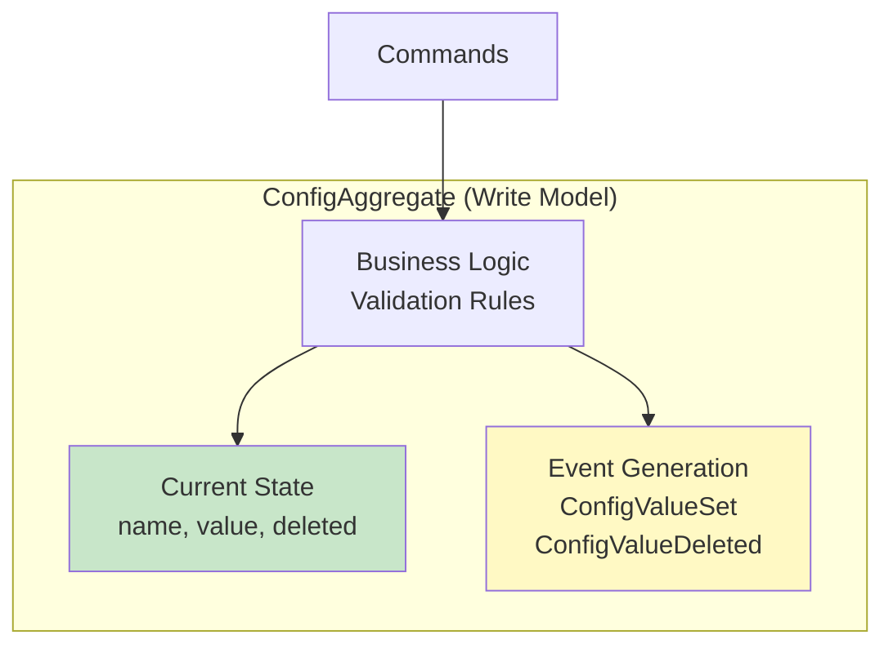
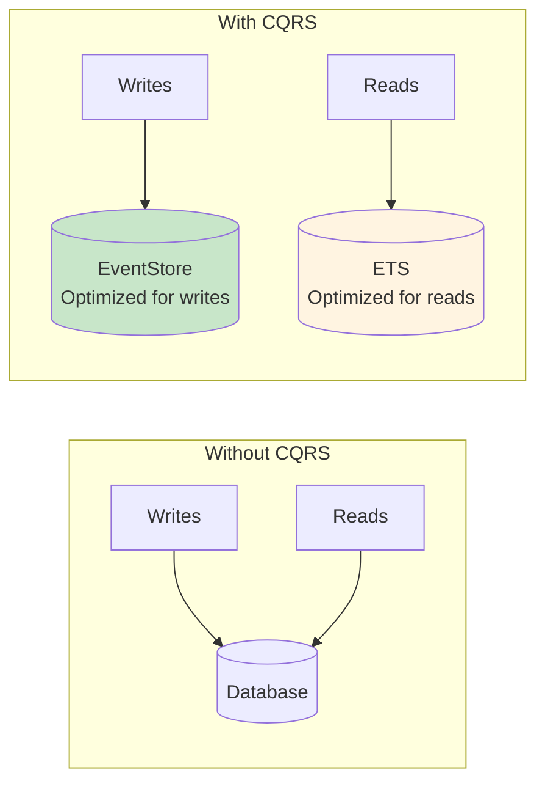
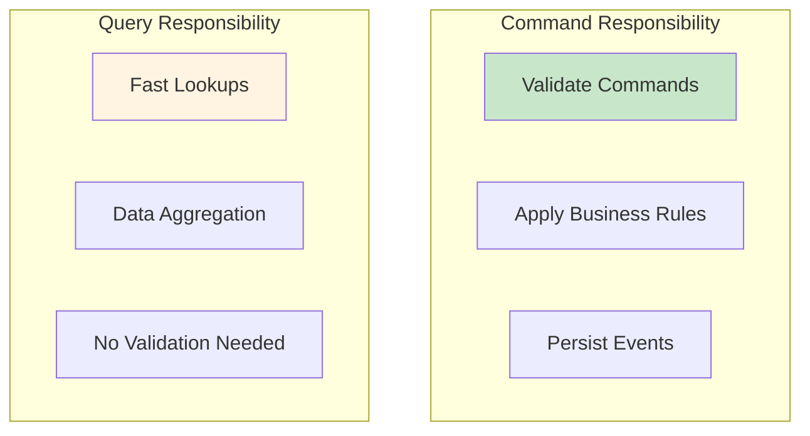

# CQRS (Command Query Responsibility Segregation)

CQRS is an architectural pattern that separates read operations (queries) from write operations (commands). ConfigApi uses CQRS to optimize performance and maintainability.

## 🎯 What is CQRS?

Traditional architecture uses the same model for reads and writes:



**Problems:**
- Same model must serve both reads and writes
- Optimization conflicts (normalize vs. denormalize)
- Complex queries impact write performance
- Difficult to scale independently

CQRS splits this into two paths:



## 🔨 Commands (Write Operations)

Commands express **intent to change state**. They can succeed or fail.

### Command Characteristics



- **Imperative** - "Set this value" not "This value is X"
- **Validated** - Business rules checked before execution
- **Atomic** - All or nothing
- **Event-Producing** - Emit domain events on success

### Command Flow in ConfigApi



### Command Examples

```elixir
# Set configuration value
ConfigStoreCQRS.put("database_url", "postgres://localhost/mydb")
# Command: SetConfigValue
# Event: ConfigValueSet

# Delete configuration
ConfigStoreCQRS.delete("old_key")
# Command: DeleteConfigValue
# Event: ConfigValueDeleted
```

### Command Implementation

```elixir
defmodule ConfigApi.ConfigStoreCQRS do
  @moduledoc """
  CQRS facade for configuration management.
  Routes commands to aggregate, queries to projection.
  """

  # COMMANDS - Modify state

  def put(name, value) do
    # 1. Create command
    command = %SetValue{name: name, value: value}

    # 2. Load aggregate (or create new)
    aggregate = ConfigAggregate.new(name)

    # 3. Execute command on aggregate
    case ConfigAggregate.execute(aggregate, command) do
      {:ok, events} ->
        # 4. Persist events to EventStore
        EventStore.append_to_stream("config-#{name}", events)
        {:ok, value}

      {:error, reason} ->
        {:error, reason}
    end
  end

  def delete(name) do
    # Similar flow for delete command
  end
end
```

## 🔍 Queries (Read Operations)

Queries **retrieve data without modification**. They always succeed (or return not found).

### Query Characteristics



- **Declarative** - "What data do I need?"
- **Side-Effect Free** - Don't modify state
- **Optimized** - Use denormalized read models
- **Fast** - ETS lookup in sub-millisecond

### Query Flow in ConfigApi



### Query Examples

```elixir
# Get single configuration
ConfigStoreCQRS.get("database_url")
# Query: GetConfig
# Source: ETS projection

# List all configurations
ConfigStoreCQRS.all()
# Query: GetAllConfigs
# Source: ETS projection

# Get event history (special query)
ConfigStoreCQRS.get_history("database_url")
# Query: GetEventHistory
# Source: EventStore directly

# Time-travel query
ConfigStoreCQRS.get_at_timestamp("database_url", ~U[2026-02-12 10:00:00Z])
# Query: GetConfigAtTime
# Source: EventStore + reconstruction
```

### Query Implementation

```elixir
defmodule ConfigApi.ConfigStoreCQRS do
  # QUERIES - Read state

  def get(name) do
    # Query optimized read model (ETS)
    ConfigStateProjection.get_config(name)
  end

  def all do
    # Query all from read model
    ConfigStateProjection.get_all_configs()
  end

  def get_history(name) do
    # Special query - read from EventStore
    EventStore.read_stream_forward("config-#{name}")
  end

  def get_at_timestamp(name, timestamp) do
    # Time-travel - reconstruct from events
    events = EventStore.read_stream_forward("config-#{name}")

    events
    |> Enum.filter(&(&1.created_at <= timestamp))
    |> Enum.reduce(nil, fn event, _state ->
      # Apply events up to timestamp
      apply_event(event.data)
    end)
  end
end
```

## 🔄 Command vs Query Comparison

| Aspect | Commands | Queries |
|--------|----------|---------|
| **Purpose** | Modify state | Retrieve data |
| **Side Effects** | Yes (persist events) | No |
| **Can Fail** | Yes (validation) | No (return not found) |
| **Return Value** | Success/Error | Data or not found |
| **Verb Tense** | Imperative | Declarative |
| **Examples** | PUT, POST, DELETE | GET |
| **Data Source** | Aggregate + EventStore | Projection (ETS) |
| **Performance** | ~20-30ms | <1ms |
| **Validation** | Business rules | None |

## 🏗️ Separate Models

### Write Model (Aggregate)



**Characteristics:**
- Contains business logic
- Validates commands
- Emits events
- Not optimized for queries
- Ephemeral (created per request)

### Read Model (Projection)

```mermaid
graph TB
    subgraph "ConfigStateProjection (Read Model)"
        ETS[ETS Table<br/>{name, value}]
        Index[Fast Lookups<br/>O(1) access]
        Denorm[Denormalized<br/>Flat structure]
    end

    Events[Events from<br/>EventStore] --> ETS
    ETS --> Index
    Index --> Denorm

    style ETS fill:#fff4e1
    style Denorm fill:#e3f2fd
```

**Characteristics:**
- Optimized for queries
- Denormalized data
- No business logic
- Fast lookups
- Persistent GenServer

## 🎭 Benefits of CQRS in ConfigApi

### 1. Performance Optimization



- **Writes**: PostgreSQL optimized for transactions
- **Reads**: ETS optimized for fast lookups
- **Independent Scaling**: Scale reads and writes separately

### 2. Clear Separation of Concerns



- Commands focus on correctness and consistency
- Queries focus on performance and usability
- Easier to reason about and test

### 3. Flexibility

- Add new query models without touching write side
- Optimize each side independently
- Support different query patterns

### 4. Audit Trail

- Commands produce events (audit log)
- Queries don't modify state (safe)
- Complete history in EventStore

## 🔐 CQRS Patterns in ConfigApi

### Command Handler Pattern

```elixir
defmodule ConfigApi.Aggregates.ConfigAggregate do
  # Handle commands
  def execute(%__MODULE__{deleted: true}, %SetValue{}) do
    {:error, :config_deleted}
  end

  def execute(%__MODULE__{} = aggregate, %SetValue{name: name, value: value}) do
    event = %ConfigValueSet{
      config_name: name,
      value: value,
      old_value: aggregate.value,
      timestamp: DateTime.utc_now()
    }

    {:ok, [event]}
  end
end
```

### Query Handler Pattern

```elixir
defmodule ConfigApi.Projections.ConfigStateProjection do
  # Handle queries
  def get_config(name) do
    case :ets.lookup(@table_name, name) do
      [{^name, value}] -> {:ok, value}
      [] -> {:error, :not_found}
    end
  end

  def get_all_configs do
    @table_name
    |> :ets.tab2list()
    |> Enum.map(fn {name, value} -> %{name: name, value: value} end)
  end
end
```

### Event Application Pattern

```elixir
defmodule ConfigApi.Projections.ConfigStateProjection do
  # Apply events to read model
  defp apply_event(%ConfigValueSet{config_name: name, value: value}) do
    :ets.insert(@table_name, {name, value})
  end

  defp apply_event(%ConfigValueDeleted{config_name: name}) do
    :ets.delete(@table_name, name)
  end
end
```

## 🎯 When to Use CQRS

### Good Use Cases ✅
- **Audit requirements** - Need complete history
- **Complex queries** - Different query patterns needed
- **Read-heavy workloads** - Many more reads than writes
- **Event sourcing** - CQRS pairs naturally with ES
- **Multiple read models** - Different views of same data

### Poor Use Cases ❌
- **Simple CRUD** - Overhead not justified
- **Tight consistency needed** - Eventual consistency issues
- **Small scale** - Added complexity not worth it
- **Frequent schema changes** - More models to update

ConfigApi is a **good fit** because:
- Configuration needs audit trail
- Reads vastly outnumber writes
- Event sourcing provides time-travel
- Simple domain (config management)

## 📚 Further Reading

- [Event Sourcing](event-sourcing.md) - How events work
- [Data Flow](data-flow.md) - Detailed request flows
- [Components](components.md) - Implementation details
- [REST API](../api/rest-api.md) - HTTP endpoints

## 🔗 External Resources

- [Martin Fowler - CQRS](https://martinfowler.com/bliki/CQRS.html)
- [Microsoft - CQRS Pattern](https://docs.microsoft.com/en-us/azure/architecture/patterns/cqrs)
- [Greg Young - CQRS Documents](https://cqrs.files.wordpress.com/2010/11/cqrs_documents.pdf)
