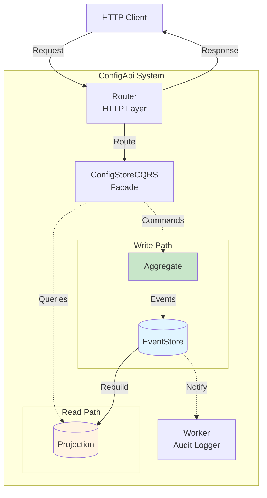
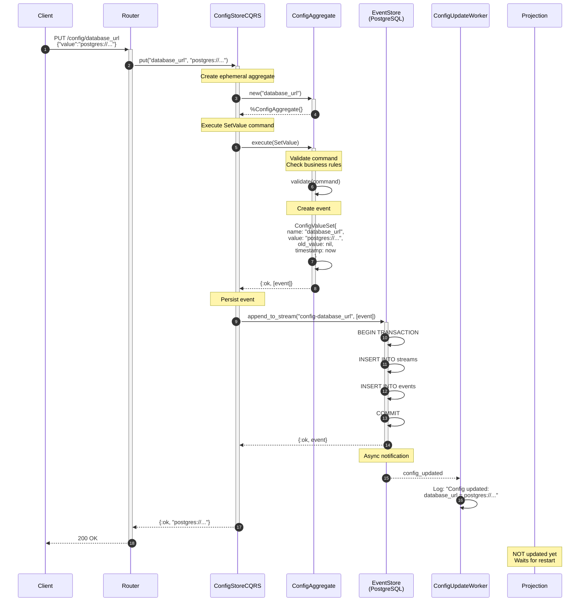
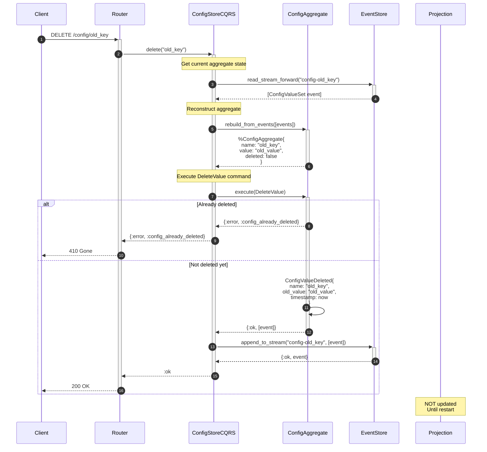
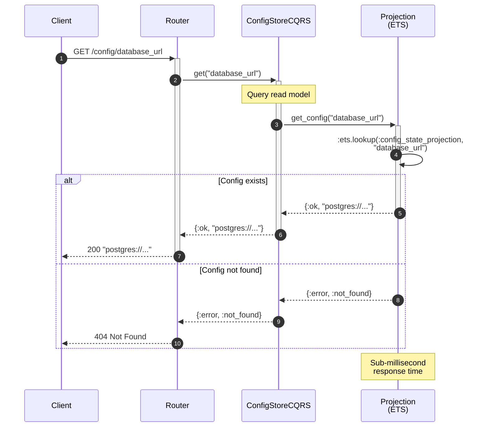
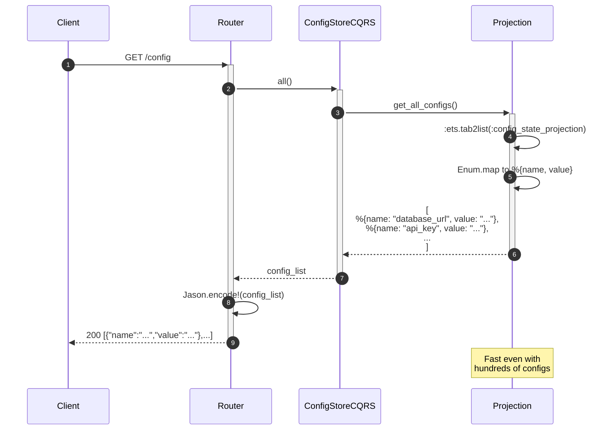
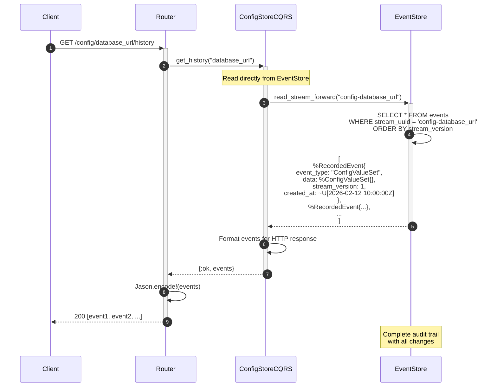
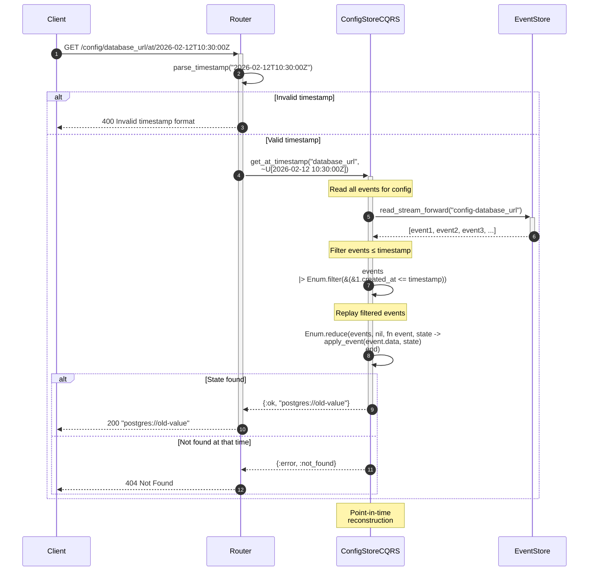
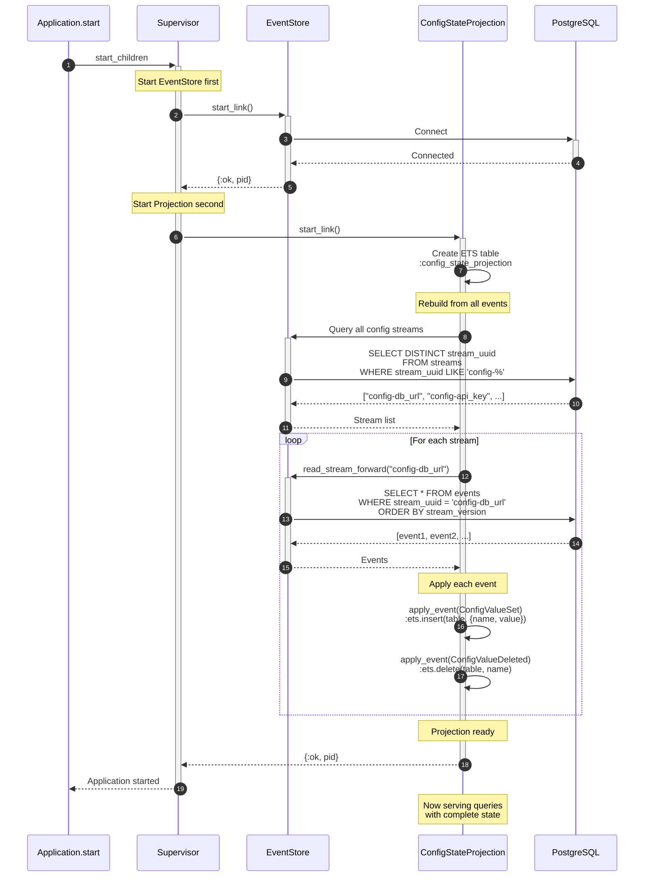
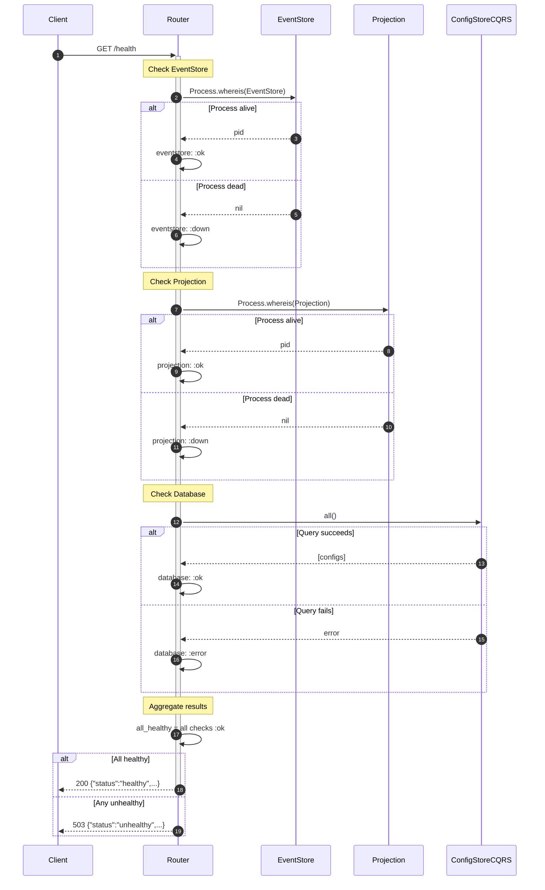
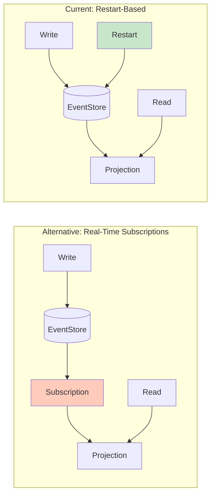

# Data Flow Diagrams

Detailed request/response flows for all operations in ConfigApi.

## 📊 Overview



---

## 🔨 Write Operations

### PUT /config/:name - Set Configuration



**Key Points:**
1. Aggregate validates business rules
2. Event created with timestamp and old value
3. Event persisted in PostgreSQL transaction
4. Worker receives async notification
5. **Projection NOT updated** (restart-based consistency)
6. Response to client before projection update

**Timing:**
- Steps 1-14: ~20-30ms
- PostgreSQL transaction: ~15ms
- Worker notification: async (doesn't block response)

---

### DELETE /config/:name - Delete Configuration



**Key Points:**
1. Must read current state to validate
2. Can't delete already-deleted config (returns 410)
3. Deletion event preserved in history
4. Soft delete (event-based), not hard delete

**Edge Cases:**
- Config never existed → 404 Not Found
- Config already deleted → 410 Gone
- Valid deletion → 200 OK

---

## 🔍 Read Operations

### GET /config/:name - Get Configuration



**Key Points:**
1. Direct ETS lookup (no database query)
2. Sub-millisecond response time
3. Returns 404 if not in projection
4. **Reflects state at last restart**

**Timing:**
- Steps 1-6: <1ms
- ETS lookup: microseconds

---

### GET /config - List All Configurations



**Performance:**
- 10 configs: ~1ms
- 100 configs: ~3ms
- 1000 configs: ~10ms

---

## 📜 Event History Operations

### GET /config/:name/history - Get Event History



**Use Cases:**
- Audit trail
- Debugging state changes
- Understanding configuration evolution
- Compliance reporting

**Data Returned:**
```json
{
  "event_type": "Elixir.ConfigApi.Events.ConfigValueSet",
  "data": {
    "config_name": "database_url",
    "value": "new_value",
    "old_value": "old_value",
    "timestamp": "2026-02-12T10:00:00Z"
  },
  "metadata": {
    "aggregate_id": "database_url",
    "aggregate_type": "ConfigValue"
  },
  "created_at": "2026-02-12T10:00:00.123456Z",
  "stream_version": 1
}
```

---

### GET /config/:name/at/:timestamp - Time-Travel Query



**Example Timeline:**

```
Time: 09:00 ---|--- 10:00 ---|--- 11:00 ---|--- 12:00 ---
              Set: "val1"   Set: "val2"   Del: null

Query at 09:30: Not Found (before first event)
Query at 10:30: "val1" (after first, before second)
Query at 11:30: "val2" (after second, before delete)
Query at 12:30: Not Found (after delete)
```

**Performance:**
- Few events (<10): ~5ms
- Medium events (10-100): ~10-20ms
- Many events (>100): ~50ms+

---

## 🔄 Projection Rebuild Flow

### Application Startup - Rebuild Process



**Rebuild Statistics:**
- 10 events: ~50ms
- 100 events: ~200ms
- 1000 events: ~1-2 seconds
- Memory: O(N) where N = number of configs

**State After Rebuild:**
```elixir
# ETS Table Contents
:ets.tab2list(:config_state_projection)
# [
#   {"database_url", "postgres://..."},
#   {"api_key", "secret-123"},
#   {"feature_flag", "enabled"}
# ]
```

---

## 🏥 Health Check Flow

### GET /health - Component Verification



**Health States:**

| Component | OK | Degraded | Down |
|-----------|-----|----------|------|
| EventStore | Process alive | - | Process dead |
| Projection | Process alive | - | Process dead |
| Database | Query works | - | Query fails |

---

## 📊 Performance Summary

### Operation Performance

| Operation | Data Source | Time | Scalability |
|-----------|-------------|------|-------------|
| PUT /config/:name | EventStore | 20-30ms | O(1) |
| GET /config/:name | ETS | <1ms | O(1) |
| GET /config | ETS | 1-10ms | O(N configs) |
| DELETE /config/:name | EventStore | 25-35ms | O(1) |
| GET /history | EventStore | 5-50ms | O(N events) |
| GET /at/:time | EventStore | 10-100ms | O(N events) |
| Rebuild | EventStore | 50ms-2s | O(N events) |
| Health Check | Processes | <5ms | O(1) |

### Throughput Estimates

**Reads (from ETS):**
- Single queries: 10,000+ req/s
- List operations: 1,000+ req/s

**Writes (to PostgreSQL):**
- Single writes: 500-1000 req/s
- Batch operations: Higher with transactions

**Mixed Workload:**
- 90% reads, 10% writes: ~8,000 req/s
- 50% reads, 50% writes: ~2,000 req/s

---

## 🎯 Design Decisions

### Why Restart-Based Consistency?



**Trade-offs:**

| Aspect | Real-Time | Restart-Based |
|--------|-----------|---------------|
| Complexity | Higher | Lower |
| Consistency | Immediate | Eventual |
| Reliability | Subscription can fail | Always rebuilds |
| Use Case | High-frequency updates | Infrequent updates |
| Debugging | Check subscription state | Just restart |

**Chosen:** Restart-based for simplicity and reliability in configuration management.

---

## 📚 Related Documentation

- **[Architecture Overview](overview.md)** - High-level system design
- **[CQRS Explained](cqrs.md)** - Command/query separation
- **[Event Sourcing](event-sourcing.md)** - Event-based persistence
- **[Components](components.md)** - Detailed component docs
