# Architecture Overview

ConfigApi is built using **CQRS** (Command Query Responsibility Segregation) and **Event Sourcing** patterns to provide a robust, auditable configuration management system.

## 🎯 Design Goals

1. **Complete Audit Trail** - Every change is recorded as an event
2. **Fast Reads** - Optimized in-memory projections
3. **Reliable Writes** - PostgreSQL-backed event persistence
4. **Time-Travel** - Query state at any point in time
5. **Production-Ready** - Proper supervision, monitoring, and error handling

## 🏗️ System Architecture

### High-Level View

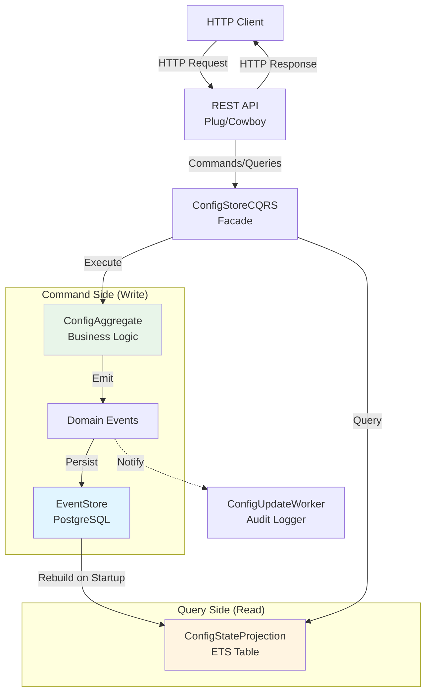

### Component Layers

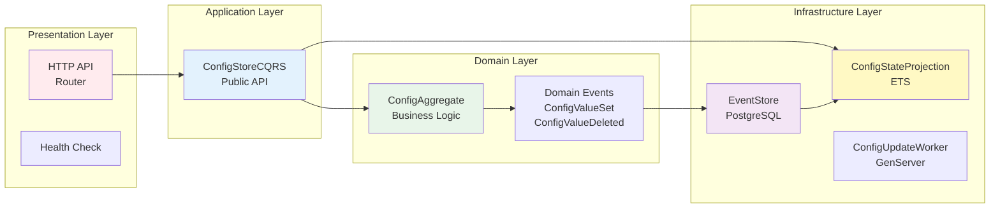

## 📊 CQRS Pattern Implementation

### Command Side (Writes)

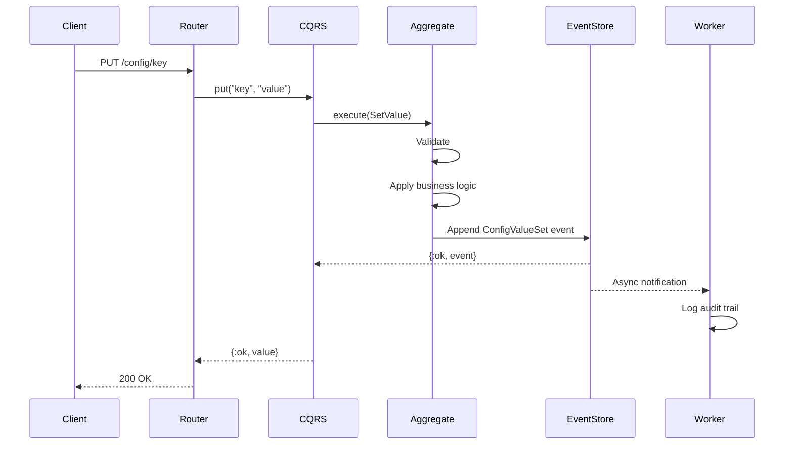

**Key Points:**
- Commands modify state through aggregates
- Aggregates emit domain events
- Events are persisted to EventStore (source of truth)
- Async worker handles audit logging
- Returns success before projection updates

### Query Side (Reads)

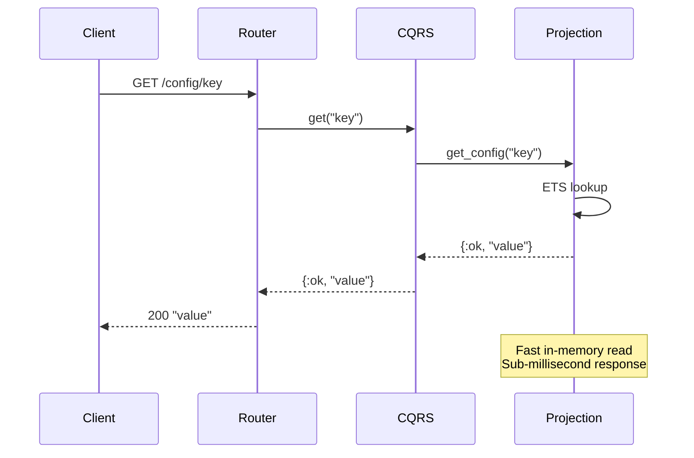

**Key Points:**
- Queries read from optimized ETS projection
- No database queries for reads
- Sub-millisecond response times
- Read model is separate from write model

## 🔄 Event Sourcing Flow

### Event Storage

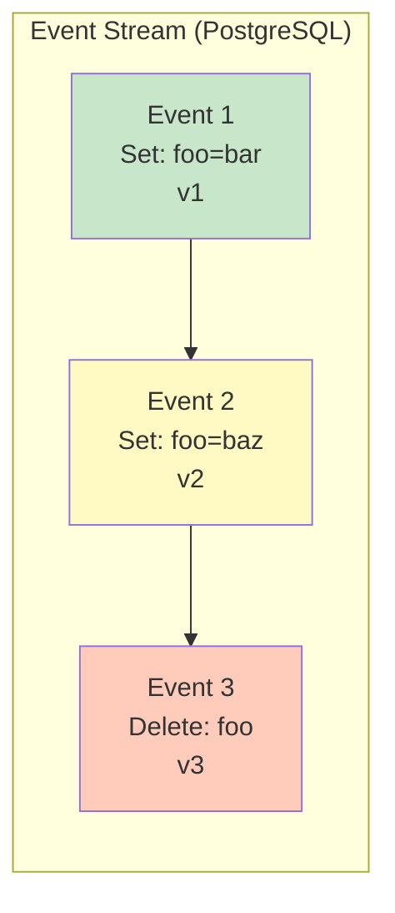

**Event Properties:**
- Immutable - never modified or deleted
- Ordered - sequential version numbers
- Complete - contains all state change information
- Timestamped - exact moment of occurrence

### State Reconstruction

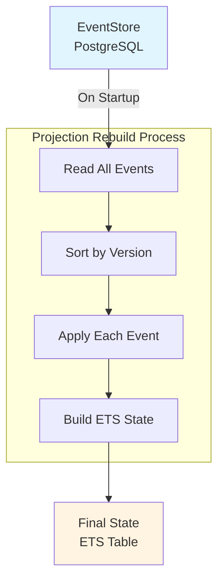

**Rebuild Process:**
1. Application starts
2. Projection reads all events from EventStore
3. Events sorted by stream version
4. Each event applied to build current state
5. ETS table ready for queries

## 🔐 Data Flow Patterns

### Write → Read Cycle

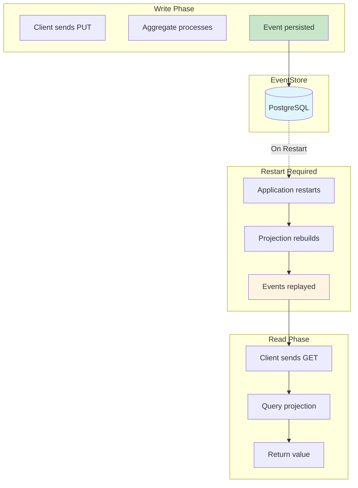

### Event History Query

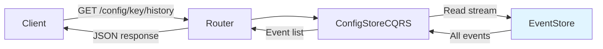

**Use Cases:**
- Full audit trail
- Change tracking
- Compliance reporting
- Debugging state changes

### Time-Travel Query

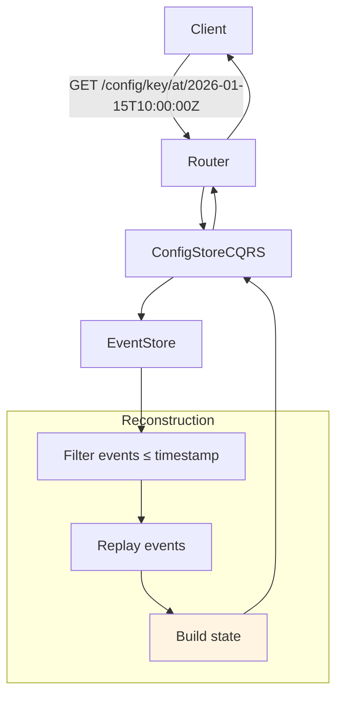

**Capabilities:**
- View state at any point in time
- Audit historical values
- Understand when changes occurred
- Debug production issues

## 🎭 Consistency Model

### Restart-Based Eventual Consistency

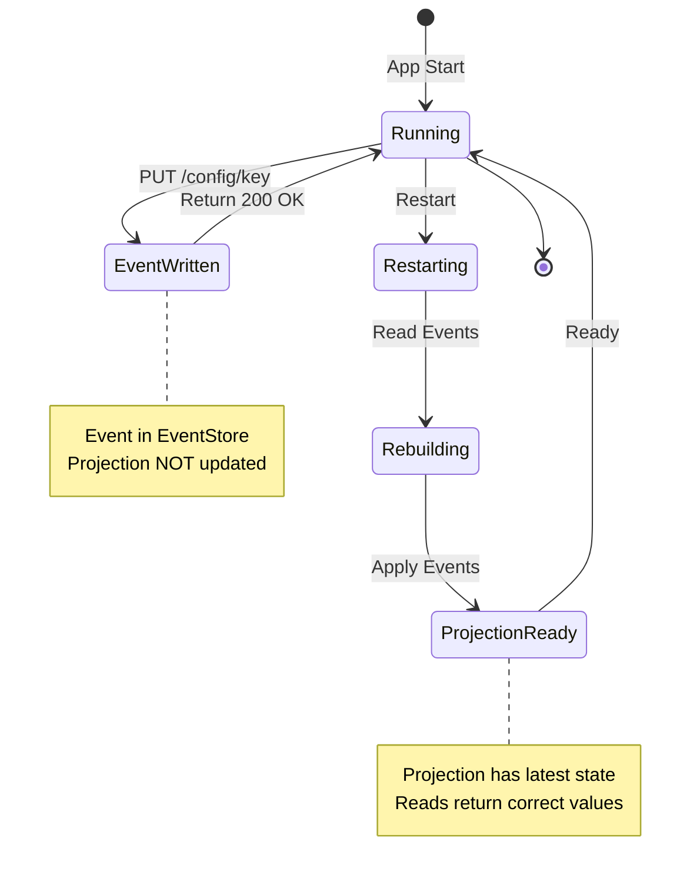

**States:**
1. **Running** - Application serving requests
2. **EventWritten** - Write succeeded, event in EventStore
3. **Restarting** - Application restarting
4. **Rebuilding** - Projection reading events
5. **ProjectionReady** - Projection has current state

**Characteristics:**
- Writes are immediately durable (PostgreSQL)
- Reads reflect state at last restart
- Suitable for infrequent updates
- Full consistency after restart

## 🏛️ Component Architecture

### Supervision Tree

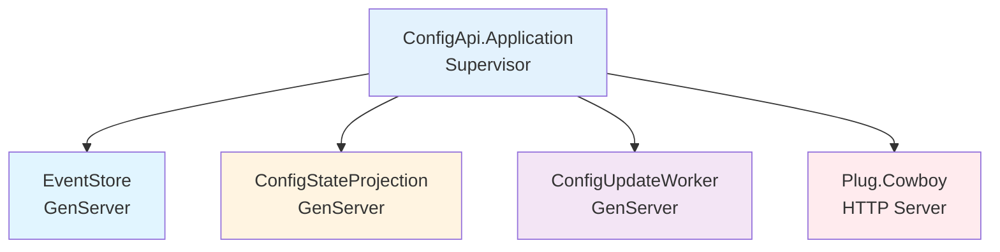

**Supervision Strategy:** `:one_for_one`
- Each child restarts independently
- EventStore must start first (Projection depends on it)
- Proper OTP application structure

### Process Communication

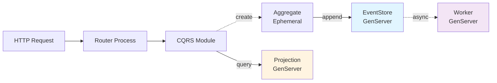

## 📈 Performance Characteristics

### Read Performance
- **Lookup**: Sub-millisecond (ETS in-memory)
- **List All**: <5ms for hundreds of configs
- **Throughput**: Thousands of reads/second

### Write Performance
- **Event Append**: 20-30ms (PostgreSQL transaction)
- **Throughput**: Hundreds of writes/second
- **Durability**: ACID guarantees from PostgreSQL

### Rebuild Performance
- **Startup**: ~50ms for 1000 events
- **Memory**: Minimal (ETS table + event cache)
- **Scalability**: Linear with event count

## 🔍 Monitoring & Observability

### Health Check Endpoint

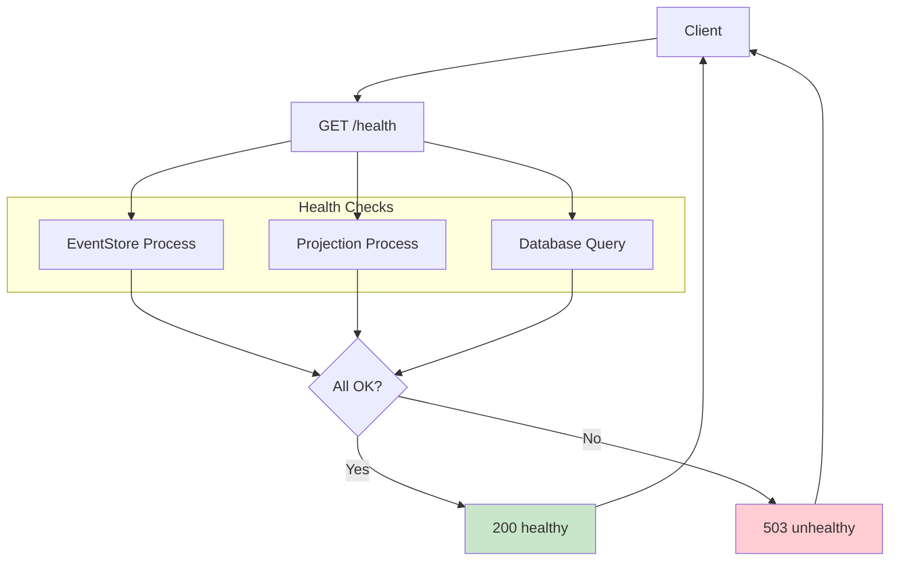

**Monitored Components:**
- EventStore process alive
- Projection process alive
- Database operations functional

## 🎓 Key Architectural Decisions

### Why CQRS?
- Optimize reads and writes independently
- Separate concerns clearly
- Enable event sourcing patterns
- Support complex queries without impacting writes

### Why Event Sourcing?
- Complete audit trail required
- Time-travel queries needed
- Debugging production issues easier
- Compliance requirements met

### Why Restart-Based Consistency?
- Configuration changes are infrequent
- Simplifies subscription complexity
- Reduces moving parts
- Acceptable trade-off for this use case

### Why ETS for Projection?
- Extremely fast reads
- Built into Erlang VM
- No external dependencies
- Simple to manage

### Why PostgreSQL for Events?
- ACID guarantees
- Mature and reliable
- Good EventStore library support
- Easy operations

## 📚 Further Reading

- [CQRS Explained](cqrs.md) - Deep dive into CQRS pattern
- [Event Sourcing](event-sourcing.md) - Understanding event sourcing
- [Data Flow](data-flow.md) - Detailed request/response flows
- [Components](components.md) - Individual component documentation

## 🔗 Related Patterns

- **Domain-Driven Design (DDD)** - Aggregates and domain events
- **Event-Driven Architecture (EDA)** - Event-based communication
- **Microservices** - Could be one service in larger system
- **Saga Pattern** - For distributed transactions (not used here)
