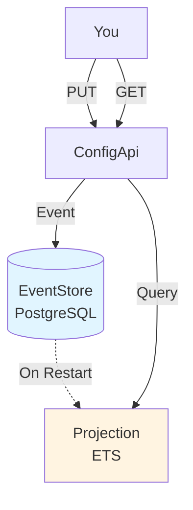
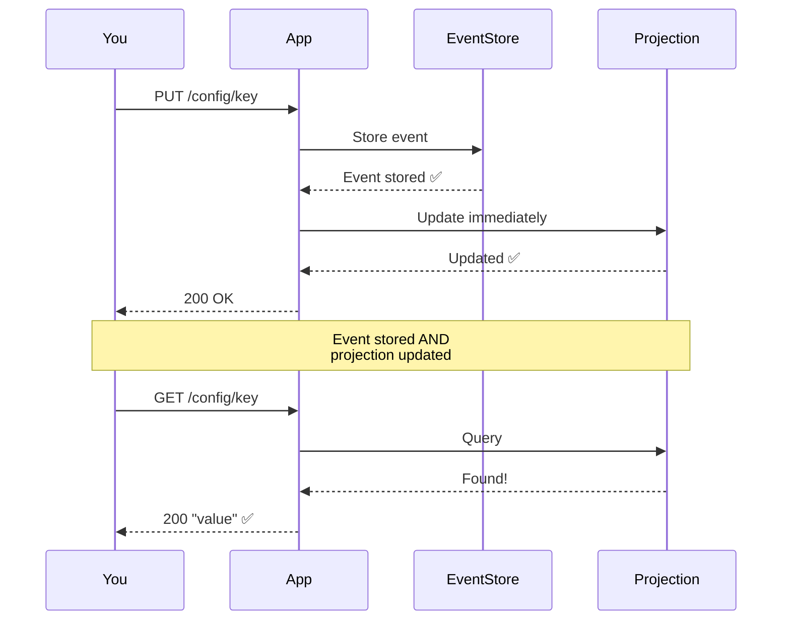

# Quick Start Guide

Get ConfigApi up and running in **5 minutes**!

## 📋 Prerequisites

- **Erlang 28.0.2** and **Elixir 1.18.4**
- **PostgreSQL 12+**
- **Git**

## 🚀 5-Minute Setup

### Step 1: Clone and Install (1 minute)

```bash
# Clone the repository
cd /path/to/your/projects
git clone <repository-url> config_api
cd config_api

# Install Erlang/Elixir via ASDF
asdf install

# Install dependencies
mix deps.get
```

### Step 2: Start PostgreSQL (1 minute)

**Option A: Docker (Recommended)**
```bash
docker run -d \
  --name config_api_postgres \
  -e POSTGRES_USER=postgres \
  -e POSTGRES_PASSWORD=postgres \
  -e POSTGRES_DB=config_api_eventstore \
  -p 5432:5432 \
  postgres:15

# Verify it's running
docker ps | grep config_api_postgres
```

**Option B: Local PostgreSQL**
```bash
# Create database
createdb config_api_eventstore

# Or with psql
psql -U postgres -c "CREATE DATABASE config_api_eventstore;"
```

### Step 3: Initialize EventStore (1 minute)

```bash
# Create EventStore schema
mix event_store.create

# Initialize EventStore tables
mix event_store.init

# Verify
psql -U postgres -d config_api_eventstore -c "\dt"
# Should show: events, projections, schema_migrations, snapshots, streams, subscriptions
```

### Step 4: Start the Application (30 seconds)

```bash
# Start with interactive shell
iex -S mix

# You should see:
# [info] Event modules loaded: ConfigValueSet, ConfigValueDeleted
# [info] Server running on http://HOST:4000
# [info] ConfigStateProjection started with 0 configs
# [info] ConfigUpdateWorker started
```

### Step 5: Try It Out! (30 seconds)

**Open a new terminal** and try these commands:

```bash
# Check health
curl http://localhost:4000/health
# {"status":"healthy","checks":{...}}

# Set a configuration
curl -X PUT http://localhost:4000/config/welcome \
  -H "Content-Type: application/json" \
  -d '{"value":"Hello ConfigApi!"}'
# OK

# View the event history
curl http://localhost:4000/config/welcome/history
# [{"event_type":"Elixir.ConfigApi.Events.ConfigValueSet",...}]

# Get the configuration (immediately available!)
curl http://localhost:4000/config/welcome
# Hello ConfigApi!

# List all configurations
curl http://localhost:4000/config
# [{"name":"welcome","value":"Hello ConfigApi!"}]
```

🎉 **Congratulations!** You're now running a production-grade CQRS/Event Sourcing system!

## 📊 What Just Happened?



1. **PUT Request** → Created a `ConfigValueSet` event
2. **Event Stored** → Persisted to PostgreSQL EventStore
3. **Restart** → Projection rebuilt from all events
4. **GET Request** → Queried the ETS projection (fast!)

## 🔍 Exploring Features

### View Event History

Every change is recorded:

```bash
curl http://localhost:4000/config/welcome/history | jq
```

```json
[
  {
    "event_type": "Elixir.ConfigApi.Events.ConfigValueSet",
    "data": {
      "config_name": "welcome",
      "value": "Hello ConfigApi!",
      "old_value": null,
      "timestamp": "2026-02-12T10:00:00Z"
    },
    "created_at": "2026-02-12T10:00:00.123456Z",
    "stream_version": 1
  }
]
```

### Time-Travel Queries

See what the value was at any point in time:

```bash
# What's the current value?
curl http://localhost:4000/config/welcome/at/2026-02-12T11:00:00Z

# Update the value
curl -X PUT http://localhost:4000/config/welcome \
  -H "Content-Type: application/json" \
  -d '{"value":"Updated value"}'

# Restart and check history
curl http://localhost:4000/config/welcome/history | jq

# Time-travel to see the old value
curl http://localhost:4000/config/welcome/at/2026-02-12T10:30:00Z
# Hello ConfigApi!

# And the new value
curl http://localhost:4000/config/welcome/at/2026-02-12T11:30:00Z
# Updated value
```

### Health Monitoring

```bash
curl http://localhost:4000/health | jq
```

```json
{
  "status": "healthy",
  "timestamp": "2026-02-12T10:30:00Z",
  "checks": {
    "eventstore": "ok",
    "projection": "ok",
    "database": "ok"
  }
}
```

## 🎯 Common Operations

### Set Configuration

```bash
curl -X PUT http://localhost:4000/config/database_url \
  -H "Content-Type: application/json" \
  -d '{"value":"postgres://localhost/mydb"}'
```

### Get Configuration

```bash
# Immediately available
curl http://localhost:4000/config/database_url
# postgres://localhost/mydb
```

### Delete Configuration

```bash
curl -X DELETE http://localhost:4000/config/old_key
```

### List All Configurations

```bash
curl http://localhost:4000/config | jq
```

## 🧪 Running Tests

```bash
# Run all tests
mix test

# Should see:
# Finished in 17.6 seconds
# 1 doctest, 102 tests, 0 failures ✅
```

## 🔄 Understanding Immediate Consistency

**How it works:** Writes are immediately visible in reads!



**Benefits:**
- ✅ Writes immediately visible in reads
- ✅ No restart required
- ✅ Event sourcing fully preserved
- ✅ Complete audit trail available
- ✅ Time-travel queries work

**Event History:**
```bash
# View complete change history
curl http://localhost:4000/config/key/history
```

## 📚 Next Steps

### Learn the Architecture

1. **[Architecture Overview](../architecture/overview.md)** - Understand the system design
2. **[CQRS Explained](../architecture/cqrs.md)** - Learn about command/query separation
3. **[Event Sourcing](../architecture/event-sourcing.md)** - Understand event-based state

### Explore the API

1. **[REST API Reference](../api/rest-api.md)** - Complete endpoint documentation
2. **[CQRS Operations](../api/cqrs-operations.md)** - Command and query examples
3. **[Time-Travel Queries](../api/time-travel.md)** - Historical data access

### Development

1. **[Development Guide](development.md)** - Set up dev environment
2. **[Testing Guide](testing.md)** - Write and run tests
3. **[Troubleshooting](troubleshooting.md)** - Common issues

## 🐛 Troubleshooting Quick Start

### PostgreSQL Connection Failed

```bash
# Check if PostgreSQL is running
docker ps | grep postgres

# Check connection
psql -U postgres -d config_api_eventstore -c "SELECT 1"

# Restart PostgreSQL
docker restart config_api_postgres
```

### Port 4000 Already in Use

```bash
# Find process using port
lsof -i :4000

# Kill it
kill -9 <PID>

# Or use a different port
# Edit config/dev.exs: port: 4001
```

### EventStore Tables Not Created

```bash
# Drop and recreate
mix event_store.drop
mix event_store.create
mix event_store.init

# Verify tables exist
psql -U postgres -d config_api_eventstore -c "\dt"
```

### Tests Failing

```bash
# Clean and reinstall dependencies
mix deps.clean --all
mix deps.get

# Recreate test database
MIX_ENV=test mix event_store.drop
MIX_ENV=test mix event_store.create
MIX_ENV=test mix event_store.init

# Run tests
mix test
```

## 💡 Tips

1. **Keep iex running** - Easier to restart than `mix run --no-halt`
2. **Use event history** - Verify writes without restarting
3. **Check health endpoint** - Diagnose component issues
4. **Read the logs** - Application logs show what's happening
5. **Run tests often** - Catch issues early

## 🎓 Learning Resources

- **README.md** - Project overview and quick reference
- **CLAUDE.md** - Development guidelines
- **QA Reports** - Testing verification results
- **[Documentation Index](../README.md)** - Complete documentation

## ✅ Checklist

- [ ] PostgreSQL running
- [ ] EventStore initialized
- [ ] Application starts without errors
- [ ] Health check returns healthy
- [ ] Can create configurations
- [ ] Can view event history
- [ ] Tests pass
- [ ] Understand restart-based consistency

**All checked?** You're ready to build with ConfigApi! 🚀

## 🆘 Need Help?

- **Architecture Questions:** See [docs/architecture/](../architecture/)
- **API Questions:** See [docs/api/](../api/)
- **Issues:** Create a GitHub issue
- **Development:** Read [Development Guide](development.md)

---

**Time to completion:** ~5 minutes
**Difficulty:** Easy
**Prerequisites:** PostgreSQL, Elixir basics
